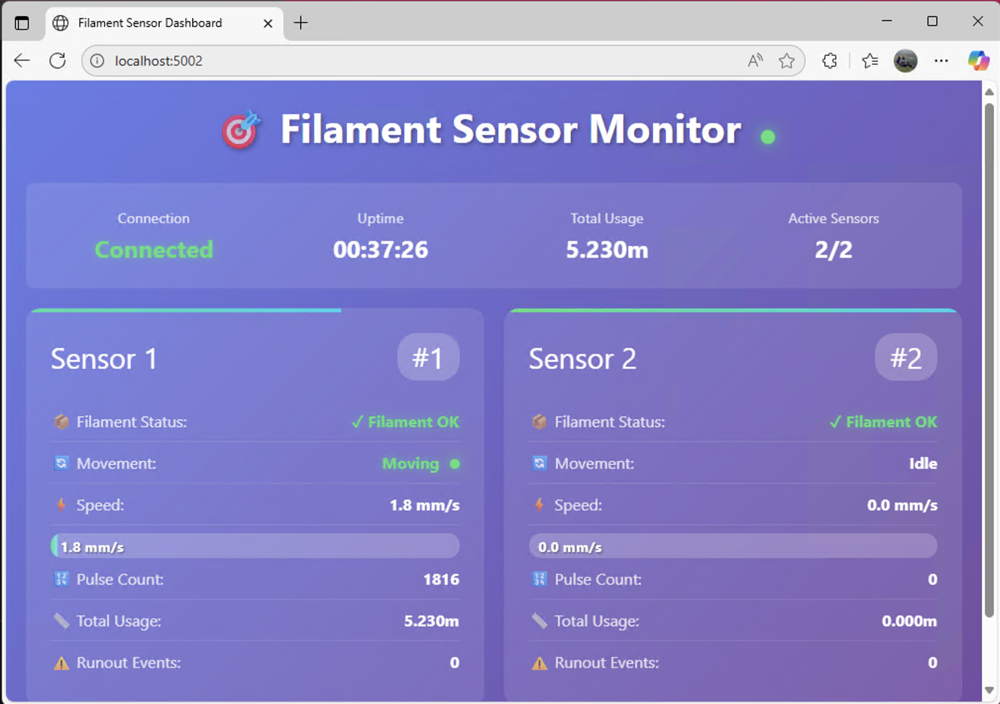

# MCP2221A Dual Filament Sensor Monitor

Real-time monitoring system for dual BIGTREETECH Smart Filament Sensors using MCP2221A USB-GPIO adapter.



## Features

- 🎯 **Dual Sensor Monitoring** - Track two filament sensors simultaneously
- 📊 **Real-time Display** - Terminal UI with split-screen visualization
- 🌐 **HTTP API** - JSON API on port 5002 for remote monitoring
- 📈 **Usage Tracking** - Calculate filament consumption (2.88mm per pulse)
- ⚡ **WebSocket Support** - Real-time updates for web clients
- 🔧 **Configurable** - YAML configuration with hot-reload
- 💾 **Session Storage** - SQLite for session-only metrics

## Quick Start

### 1. Hardware Setup

Connect your sensors to the MCP2221A:

| MCP2221A Pin | Connection |
|-------------|------------|
| GP0 | Sensor 1 Movement Signal |
| GP1 | Sensor 1 Runout Signal |
| GP2 | Sensor 2 Movement Signal |
| GP3 | Sensor 2 Runout Signal |
| VCC (3.3V) | Both sensors power (+) |
| GND | Both sensors ground (-) |

### 2. Software Installation

#### Windows (Recommended)

1. Install Python 3.11+ from [python.org](https://python.org)
2. Connect MCP2221A via USB
3. Run the quick test:
```batch
run_test.bat
```

4. Install full application:
```bash
pip install -r requirements.txt
python main.py
```

#### Manual Installation

```bash
# Clone repository
git clone [repository-url]
cd runout

# Create virtual environment
python -m venv venv
venv\Scripts\activate  # Windows
source venv/bin/activate  # Linux/Mac

# Install dependencies
pip install -r requirements.txt

# Test hardware connection
python test_hardware.py

# Run application
python main.py
```

## Testing

### Hardware Test
```bash
# Simple hardware test (no dependencies)
python test_hardware.py

# Test MCP2221A connection only
python -m src.lib.mcp2221_sensor --test-connection

# Monitor GPIO pins in real-time
python -m src.lib.mcp2221_sensor monitor
```

### Demo Mode (No Hardware Required)
```bash
# Run with simulated data
python main.py --demo

# API server with demo data
python -m src.lib.api_server --demo

# Terminal UI with demo data
python -m src.lib.display --demo
```

## Configuration

Edit `config.yaml`:

```yaml
sensors:
  sensor_1:
    movement_pin: 0        # GPIO pin for movement
    runout_pin: 1         # GPIO pin for runout
    calibration_mm_per_pulse: 2.88
    enabled: true
  sensor_2:
    movement_pin: 2
    runout_pin: 3
    calibration_mm_per_pulse: 2.88
    enabled: true

polling:
  interval_ms: 100        # Sensor polling rate
  debounce_ms: 2         # Debounce for noise
  timeout_seconds: 5     # Movement timeout

api:
  port: 5002
  host: "0.0.0.0"
```

## API Endpoints

- `GET /status` - Current sensor status and filament presence
- `GET /config` - System configuration
- `POST /config` - Update configuration
- `GET /metrics` - Session metrics and usage
- `GET /alerts` - Active alerts
- `WebSocket /ws` - Real-time updates

Access API documentation at: http://localhost:5002/docs

## Command Line Options

```bash
# Main application
python main.py [options]
  --config FILE       Configuration file (default: config.yaml)
  --debug            Enable debug logging
  --demo             Run in demo mode (no hardware)
  --no-api          Disable API server
  --no-display      Disable terminal UI
  --export-config    Export current configuration

# Individual components
python -m src.lib.mcp2221_sensor [test-connection|monitor|info]
python -m src.lib.display [--demo] [--layout split|compact|debug]
python -m src.lib.api_server [--port PORT] [--demo]
python -m src.lib.config [validate|export|create] [FILE]
```

## Terminal UI Keyboard Shortcuts

- `q` or `Ctrl+C` - Quit application
- `r` - Reset session metrics
- `1` - Toggle Sensor 1
- `2` - Toggle Sensor 2
- `a` - Acknowledge alerts
- `d` - Toggle debug display
- `Tab` - Switch layout

## Troubleshooting

### MCP2221A Not Detected

1. Check Device Manager → Human Interface Devices → MCP2221 USB-I2C/UART Combo
2. Try different USB port (avoid hubs initially)
3. Install driver from [Microchip](https://www.microchip.com/mcp2221)

### No Sensor Response

1. Verify wiring connections
2. Check sensor power (3.3V between VCC and GND)
3. Run hardware test: `python test_hardware.py`
4. Enable debug: `python main.py --debug`

### Incorrect Distance Measurements

1. Calibrate your sensor:
   - Mark 100mm of filament
   - Pull through sensor
   - Count pulses in debug log
   - Update `calibration_mm_per_pulse` = 100 / pulse_count

### Permission Errors (Windows)

1. Run as Administrator if needed
2. Check Windows Defender/Antivirus exceptions
3. Ensure no other application is using the MCP2221A

## Project Structure

```
runout/
├── src/
│   ├── models/         # Data models
│   ├── services/       # Core services
│   ├── cli/           # Main application
│   └── lib/           # Feature libraries
│       ├── mcp2221_sensor/  # Hardware interface
│       ├── display/         # Terminal UI
│       ├── api_server/      # HTTP/WebSocket API
│       └── config/          # Configuration management
├── tests/
│   ├── contract/      # API contract tests
│   ├── integration/   # Integration tests
│   └── unit/         # Unit tests
├── config.yaml        # Configuration
├── requirements.txt   # Dependencies
└── test_hardware.py   # Hardware test script
```

## Development

### Running Tests
```bash
# All tests
pytest

# Contract tests only
pytest tests/contract/ -m contract

# Integration tests
pytest tests/integration/ -m integration

# With coverage
pytest --cov=src --cov-report=html
```

### TDD Workflow
1. Write failing test
2. Implement minimal code to pass
3. Refactor while keeping tests green
4. Commit with descriptive message

## Performance Targets

- Sensor polling: 10ms hardware, 100ms configurable
- UI update latency: <10ms
- API response time: <5ms
- Memory usage: <50MB for 24-hour session
- CPU usage: <5% idle, <15% active


## Support
- Hardware: [BIGTREETECH Sensor Docs](https://github.com/bigtreetech)

## Credits

Built with:
- [EasyMCP2221](https://github.com/electronicayciencia/EasyMCP2221) - USB-GPIO interface
- [FastAPI](https://fastapi.tiangolo.com/) - API framework
- [Textual](https://textual.textualize.io/) - Terminal UI
- [Pydantic](https://pydantic-docs.helpmanual.io/) - Data validation