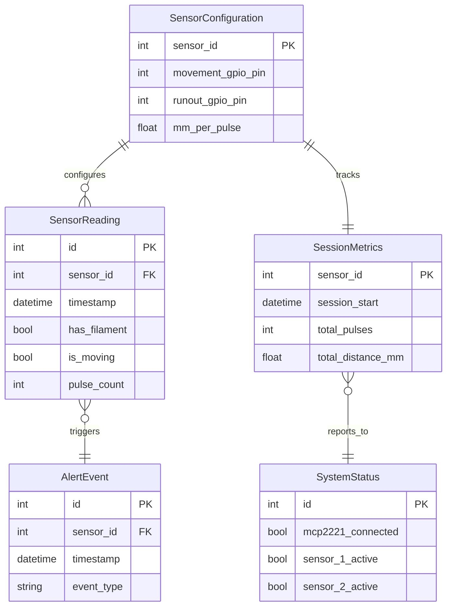

# Data Model: MCP2221A Dual Filament Sensor Monitor

**Version**: 1.0.0
**Date**: 2025-09-15

## Core Entities

### 1. SensorReading
**Purpose**: Captures instantaneous sensor state and measurements
```python
class SensorReading:
    id: int                    # Auto-increment primary key
    timestamp: datetime        # UTC timestamp of reading
    sensor_id: int            # Sensor identifier (1 or 2)
    has_filament: bool        # Filament presence detected
    is_moving: bool           # Movement currently detected
    pulse_count: int          # Cumulative pulses this session
    raw_signal: int           # Raw GPIO signal value (0 or 1)

    # Calculated fields
    distance_mm: float        # Calculated from pulse_count * calibration

    # Constraints
    - sensor_id IN (1, 2)
    - timestamp must be UTC
    - pulse_count >= 0
```

### 2. SensorConfiguration
**Purpose**: Stores configurable parameters for each sensor
```python
class SensorConfiguration:
    sensor_id: int                     # Primary key (1 or 2)
    movement_gpio_pin: int             # GPIO pin for movement signal (0-3)
    runout_gpio_pin: int               # GPIO pin for runout signal (0-3)
    mm_per_pulse: float                # Calibration factor (default: 2.88)
    polling_interval_ms: int           # Sensor polling rate (default: 100)
    debounce_ms: int                   # Debounce window (default: 2)
    enabled: bool                      # Sensor active flag

    # Constraints
    - sensor_id IN (1, 2)
    - movement_gpio_pin IN (0, 1, 2, 3)
    - runout_gpio_pin IN (0, 1, 2, 3)
    - movement_gpio_pin != runout_gpio_pin
    - mm_per_pulse > 0
    - polling_interval_ms >= 10
    - debounce_ms >= 0
```

### 3. SessionMetrics
**Purpose**: Aggregated metrics for current monitoring session
```python
class SessionMetrics:
    sensor_id: int                    # Primary key
    session_start: datetime           # Session start timestamp
    total_pulses: int                 # Total pulses counted
    total_distance_mm: float          # Total distance in millimeters
    total_distance_m: float           # Total distance in meters
    last_movement: datetime           # Last movement detected
    runout_events: int                # Count of runout detections
    movement_periods: int             # Count of movement periods
    idle_time_seconds: float          # Total idle time
    active_time_seconds: float        # Total active time

    # Calculated fields
    average_speed_mm_per_s: float    # Average movement speed

    # Constraints
    - sensor_id IN (1, 2)
    - total_pulses >= 0
    - total_distance_mm >= 0
    - runout_events >= 0
```

### 4. AlertEvent
**Purpose**: Records significant sensor events requiring attention
```python
class AlertEvent:
    id: int                          # Auto-increment primary key
    timestamp: datetime              # Event timestamp
    sensor_id: int                   # Affected sensor
    event_type: str                  # Event classification
    severity: str                    # Event severity level
    message: str                     # Human-readable description
    acknowledged: bool               # User acknowledgment flag
    acknowledged_at: datetime        # Acknowledgment timestamp

    # Event types
    EVENT_TYPES = [
        'RUNOUT_DETECTED',          # Filament exhausted
        'FILAMENT_INSERTED',         # Filament loaded
        'MOVEMENT_STARTED',          # Printing resumed
        'MOVEMENT_STOPPED',          # Printing paused
        'SENSOR_DISCONNECTED',       # Hardware issue
        'SENSOR_RECONNECTED'         # Hardware recovered
    ]

    SEVERITY_LEVELS = ['INFO', 'WARNING', 'ERROR', 'CRITICAL']

    # Constraints
    - event_type IN EVENT_TYPES
    - severity IN SEVERITY_LEVELS
    - sensor_id IN (1, 2)
```

### 5. SystemStatus
**Purpose**: Overall system state and health
```python
class SystemStatus:
    id: int                          # Singleton (always 1)
    mcp2221_connected: bool          # USB adapter status
    mcp2221_serial: str              # Device serial number
    sensor_1_active: bool            # Sensor 1 operational
    sensor_2_active: bool            # Sensor 2 operational
    api_server_running: bool         # HTTP server status
    api_server_port: int             # Active port number
    last_update: datetime            # Status update timestamp
    system_version: str              # Application version
    uptime_seconds: float            # System uptime

    # Constraints
    - id = 1 (singleton)
    - api_server_port >= 1024
    - uptime_seconds >= 0
```

## Relationships



## State Transitions

### Sensor State Machine
```
DISCONNECTED → IDLE → ACTIVE → MOVING
     ↑          ↓       ↓        ↓
     └──────────┴───────┴────────┘
```

**States:**
- **DISCONNECTED**: No hardware connection
- **IDLE**: Connected, filament present, not moving
- **ACTIVE**: Connected, monitoring for movement
- **MOVING**: Filament movement detected

**Transitions:**
- DISCONNECTED → IDLE: USB connection established
- IDLE → ACTIVE: Monitoring started
- ACTIVE → MOVING: Pulses detected
- MOVING → ACTIVE: No pulses for timeout period
- ANY → DISCONNECTED: USB connection lost

## Validation Rules

### Cross-Entity Validation
1. **GPIO Pin Uniqueness**: No two sensors can use the same GPIO pin
2. **Pulse Consistency**: pulse_count must increase monotonically per sensor
3. **Timestamp Ordering**: All timestamps must be sequential
4. **Session Boundary**: Metrics reset when session_start changes

### Business Rules
1. **Movement Detection**: is_moving = true requires pulse within last 5 seconds
2. **Runout Alert**: Alert generated when has_filament changes to false
3. **Calibration Limits**: mm_per_pulse must be between 0.1 and 10.0
4. **Polling Limits**: polling_interval_ms must be between 10 and 1000

## API Response Models

### StatusResponse
```json
{
  "timestamp": "2025-09-15T10:30:00Z",
  "system": {
    "connected": true,
    "version": "0.1.0",
    "uptime_seconds": 3600
  },
  "sensors": [
    {
      "id": 1,
      "has_filament": true,
      "is_moving": true,
      "usage_meters": 1.234,
      "last_movement": "2025-09-15T10:29:55Z"
    },
    {
      "id": 2,
      "has_filament": true,
      "is_moving": false,
      "usage_meters": 0.456,
      "last_movement": "2025-09-15T09:15:00Z"
    }
  ]
}
```

### ConfigurationResponse
```json
{
  "sensors": [
    {
      "id": 1,
      "movement_pin": 0,
      "runout_pin": 1,
      "calibration_mm_per_pulse": 2.88,
      "enabled": true
    },
    {
      "id": 2,
      "movement_pin": 2,
      "runout_pin": 3,
      "calibration_mm_per_pulse": 2.88,
      "enabled": true
    }
  ],
  "polling": {
    "interval_ms": 100,
    "debounce_ms": 2
  }
}
```

## Storage Schema (SQLite)

```sql
-- Session-only in-memory database
CREATE TABLE sensor_readings (
    id INTEGER PRIMARY KEY AUTOINCREMENT,
    timestamp DATETIME NOT NULL,
    sensor_id INTEGER NOT NULL CHECK (sensor_id IN (1, 2)),
    has_filament BOOLEAN NOT NULL,
    is_moving BOOLEAN NOT NULL,
    pulse_count INTEGER NOT NULL CHECK (pulse_count >= 0),
    raw_signal INTEGER NOT NULL,
    distance_mm REAL NOT NULL,
    created_at DATETIME DEFAULT CURRENT_TIMESTAMP
);

CREATE INDEX idx_readings_sensor_time ON sensor_readings(sensor_id, timestamp);

CREATE TABLE session_metrics (
    sensor_id INTEGER PRIMARY KEY CHECK (sensor_id IN (1, 2)),
    session_start DATETIME NOT NULL,
    total_pulses INTEGER NOT NULL DEFAULT 0,
    total_distance_mm REAL NOT NULL DEFAULT 0,
    total_distance_m REAL GENERATED ALWAYS AS (total_distance_mm / 1000) STORED,
    last_movement DATETIME,
    runout_events INTEGER NOT NULL DEFAULT 0,
    movement_periods INTEGER NOT NULL DEFAULT 0,
    idle_time_seconds REAL NOT NULL DEFAULT 0,
    active_time_seconds REAL NOT NULL DEFAULT 0
);

CREATE TABLE alert_events (
    id INTEGER PRIMARY KEY AUTOINCREMENT,
    timestamp DATETIME NOT NULL,
    sensor_id INTEGER NOT NULL CHECK (sensor_id IN (1, 2)),
    event_type TEXT NOT NULL,
    severity TEXT NOT NULL CHECK (severity IN ('INFO', 'WARNING', 'ERROR', 'CRITICAL')),
    message TEXT NOT NULL,
    acknowledged BOOLEAN NOT NULL DEFAULT 0,
    acknowledged_at DATETIME
);

CREATE INDEX idx_alerts_unack ON alert_events(acknowledged) WHERE acknowledged = 0;
```

## Data Lifecycle

### Session Management
- Data persists only during application runtime
- All tables cleared on application start
- No persistent storage between sessions

### Memory Management
- Maximum 10,000 readings retained per sensor
- Older readings pruned every hour
- Alert history limited to 1,000 events

### Performance Targets
- Insert latency: <1ms
- Query latency: <5ms
- Memory usage: <50MB for 24-hour session